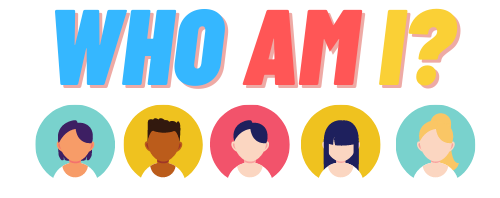
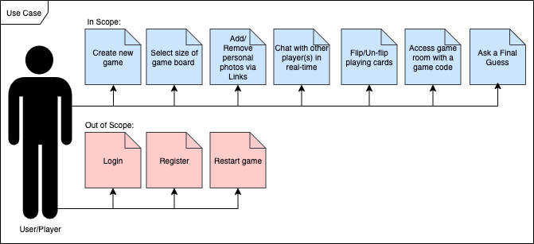
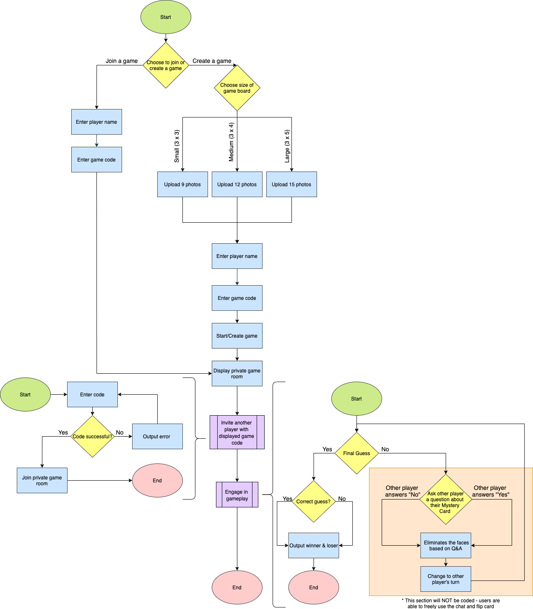
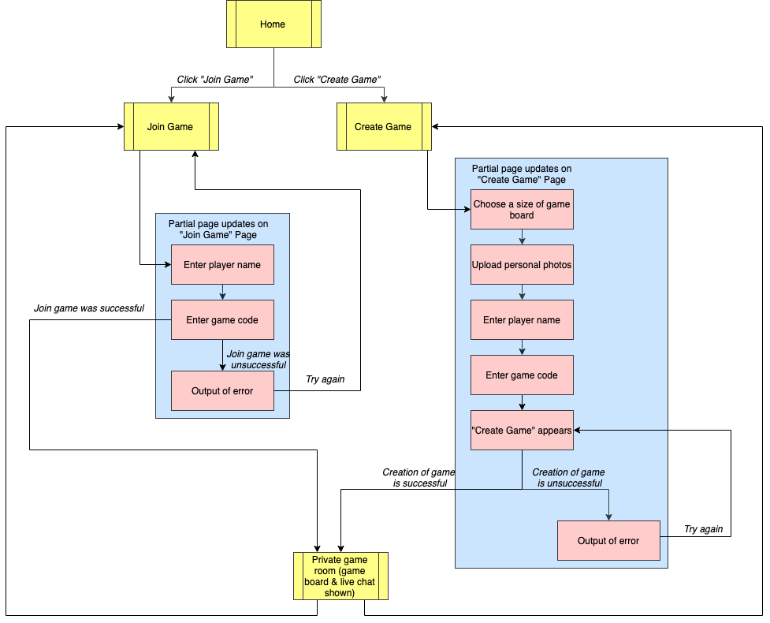
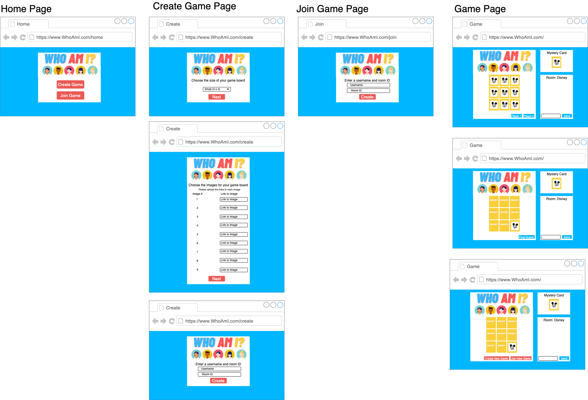

# Who Am I? by Almicke Navarro (Mentor: Isaiah Discipulo)
* A web-based application that allows players to play a personalized version of "Guess Who?" in a private game room with a chat 

## Introduction
* With the COVID-19 pandemic, people spent a majority of their time in quarantine. This brought about loneliness, depression, and lack of social interactions. In order to help this effort, I decided to create an online game application for my Senior Capstone. Seeing as though there is no current online, personalized "Guess Who?" game, I decided to create one.

## Requirements
* Functional Requirements
  - 

* Non-Functional Requirements
  - HTTP/CSS will be used to make the user interface colorful, organized, and user-friendly.
  - Bootstrap will be used to create a responsive user interface.
  - WebSocket will be used to create private game rooms.
  - STOMP will be used to send messages to other user(s).
  - JavaScript will be used to dynamically build the forms and gameboards. 
  - JavaScript will be used to instantiate the use of WebSocket and STOMP.
 
## Technologies
* Java Spring Boot is an open source Java-based framework used to create a micro Service.
* JavaScript is a programming language used to add dynamic and interactive elements to the application. 
* WebSocket is a computer communications protocol, providing full-duplex communication channels over a single TCP connection. 
* STOMP(Simple Text Orientated Messaging Protocol) is a simple protocol that allows the client and server to communicate with each other. 
* Hypertext Markup Language (HTML)/Cascading Style Sheets (CSS) are two of the core technologies used to build the layout and structure of a web page. 
* Bootstrap is an open-source front-end framework used to create modern websites and web apps. 
* Eclipse for Java is an open-source Integrated Development Environment (IDE) supported by IBM.
* Oracle JDK 8 is a development environment for building applications in Java. 

## General Technical Approach 
* When I decided on creating a personalized version of “Guess Who?” for the Senior Capstone Project, I knew that I wanted to use one of my old applications as reference. I decided to use my C# Minesweeper Game from CST-227/247 and my Java Artist Website from CST-341 because they were the most recent applications I had finished in previous classes and they were the ones I was the most familiar with. With the C# Minesweeper Game, I plan to use the Game Logic to set up the game board and to mimic the way the entire game is sent through a bundle to the frontend. The only difference is that I had to create my board game with images provided by the users. With the Java Artist Website, I plan to use the n-tier design of the architecture and the bootstrap design as a skeleton. In order to fully mimic the original game, I knew that I needed to have a chat room so I referred to other games like “Skribbl.io” and “Among Us” to understand how to do that. After research, I discovered that I could use WebSockets to achieve this. 

## Technical Design Decisions
* Logical Flowchart 

* Sitemap

* User Interface Diagrams

* Class Diagram

## Risks & Challenges
* Risks
  - Developer(s) does not have the knowledge to incorporate Web Sockets and STOMP
  - Developer(s) does not have the knowledge to utilize JavaScript
  - Developer(s) does not have the knowledge to utilize Spring Boot
* Challenges
  - When starting this project, I only understood how to use the Java Spring framework. In order to overcome this challenge, I watched multiple videos and did mutliple tutorials in order to learn about how to use WebSocket, STOMP, JavaScript, and Spring Boot. I even studied people's GitHub repos with project with the technologies I did not know how to use. Through studying the GitHubs, I was able to use those projects as reference for my project. Another challenege I had encountered that my photo upload no longer worked when I converted my project from a Spring project to a Spring Boot project. I still needed personal photos to be incorporated so one of the members of my CLC group in CST-235, Melanie Spence, informed me that I could use image links instead. 

## Outstanding Issues
* Image link inputs accept null or empty inputs 
* When joining a game, you are able to create a new game room with a new game code. The game page will not output a board game. 
* Due to not restarting the endpoints, certain game codes with previous connections will fail

## Potentional Additions
* Ability to restart game with the previously uploaded photos
* Ability to link to social media account(s)
* Ability to store the photos in an account
* Ability to create/register for an account
* Ability to access a private room even if the host has left
* Ability to choose default/pre-made boards
* Ability to act as a spectator

## Cloud Computing 
* Currently, this application is not yet available in the cloud. However, I do plan to deploy it to the Cloud when I fix my outstanding issues and add my potentional additions. With the help of my mentor, Isaiah Discipulo, I believe I will be able to accomplish that. I plan to potentially use either Heroku or Azure as my Cloud Provider because I was fortunate enough to gain experience in these specific Clouds. 
